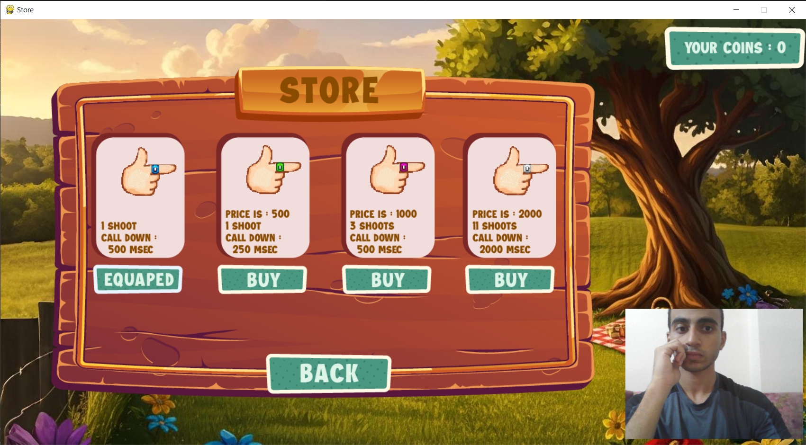

# 🎮 2D Gesture Shooter  

## Introduction  
2D Gesture Shooter is a unique 2D shooting game where you control the gameplay entirely through hand gestures.  
The game offers an exciting mix of single-player battles against waves of monsters and an intense player-vs-player mode for competitive fun.  

Alongside the core gameplay, there’s a weapon shop where players can purchase different weapons using in-game coins.  
Coins are collected as your score in each round, making every game both rewarding and challenging.  

---

## Features  

- 🎮 Game Modes  
  - Single Player: Fight against waves of monsters and collect coins (score).  
  - Player vs Player (PvP):  
    - First player to win *3 rounds* is the winner.  
    - Each round, the weapon automatically changes.  
    - Both players always have the same weapon in each round.  
    - Two arena variations with the same background but different central obstacles.  

- 🔫 Weapons  
  - 4 purchasable weapons available in the shop.  
  - An exclusive fifth weapon only available in PvP mode (not in the shop).  

- 👾 Enemies  
  - Different types of monsters in single-player mode.  
  - Each enemy type gives a different score value when defeated.  

- 💰 Coins System  
  - Coins are equivalent to your score in each round.  
  - Use coins to buy weapons and improve your chances of survival.  

---

## Controls  

- ⌨ Keyboard  
  - Player 1:  
    - Move: ↑ / ↓  
    - Shoot: Space / Numpad Enter  
  - Player 2:  
    - Move: W / S  
    - Shoot: C  
  - Pause:  
    - press ESC → Pause game  

- ✋ Hand Gestures  
  - Movement (Thumb):  
    - Point up → Move up  
    - Point down → Move down  
    - Point in-between → Stay still  
  - Shooting (Index Finger):  
    - Finger extended → No shooting  
    - Finger bent (like pressing a trigger) → Shoot  
  - Pause:  
    - Open both hands in front of the camera → Pause game  

---

## How to Play  

1. Choose your mode: Single Player or PvP.  
2. Defeat enemies (or your opponent in PvP) to score points.  
3. Collect coins (your score) and use them to buy new weapons from the shop.  
4. In PvP mode, the first player to win **3 rounds** is the champion.  
5. Weapons change automatically each round in PvP, and both players use the same one.  
6. Use either keyboard or hand gestures to control your character.  
7. To pause the game, open both hands in front of the camera.  

---

## Requirements & Installation  
- Notice : The Python version used is 3.12 because it is  mediapipe module requiments for the last version of it 
- All required libraries are listed in requirements.txt 

---

## Authors

Abdulrahman Ehab – Gameplay programming, hand gesture controls, and game logic.
Ahmed Hazem – Art design, menus logic, and data store.
Abdulrahman Ehab & Ahmed Hazem – Project idea and overall development.

---

## Game Show

Game Modes Overview


Weapon Shop



Single Player


Player vs Player


### Installation  

```bash

# Clone the repository
git clone https://github.com/username/game-project.git
cd game-project

# Install the requirements
pip install -r requirements.txt

# Run the game
python Main_window.py


